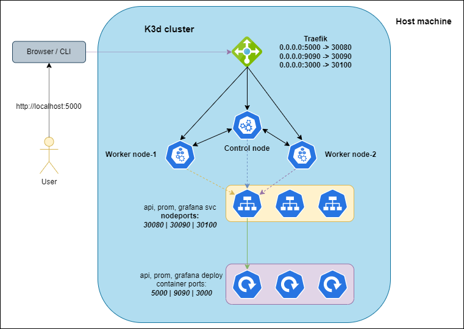

# SRE/DevOps Challange

## Prepare development environment

Prerequisites:

- Installed Python3.x
- Installed Docker

Check versions

```bash
python3 -V
docker --version
```

> Notice that I use in my current environment `Python 3.10.4` and `Docker 20.10.17`

Create Python virtual env

```bash
cd ~/github/sre-challange/solution/

python3 -m venv .venv
source .venv/bin/activate

python3 -m pip install --upgrade pip
```

Install (base) dependecies

```bash
cd src
pip3 install -e .[dev]
pytest storage/test.py
```

> Notice that you need to get 4 passed test results

Install aditional dependency for prometheus

```bash
pip3 install prometheus_client
```

> Notice that the latest client version is 0.14.0 in my dev environment

---

## Develop new API metrics for Prometheus

Python client library for Prometheus - [Github Link](https://github.com/prometheus/client_python/blob/master/README.md)

Changed files:

- src/storage/__init.py
- src/storage/bucket.py
- src/setup.py

If we would like to create separated `requirements.txt` for production setup

```bash
pip3 freeze | grep Flask > requirements.txt
pip3 freeze | grep ^waitress >> requirements.txt
pip3 freeze | grep prometheus >> requirements.txt
```

Manual Docker build for development

```bash
cd ~/src

docker build -t storage:dev -f Dockerfile.dev .

docker run -d --rm -p 5000:5000 --name storage_api storage:dev
```

Manual Docker build for production

```bash
cd ~/src

docker build -t storage:prod -f Dockerfile .

docker run -d --rm -p 5000:5000 --name storage_api storage:prod
```

Sample warning for Flask in production environment

```text
 * Serving Flask app 'run' (lazy loading)
 * Environment: production
   WARNING: This is a development server. Do not use it in a production deployment.
   Use a production WSGI server instead.
 * Debug mode: off
 * Running on http://127.0.0.1:5000 (Press CTRL+C to quit)
 ```

---

## Deploy full environment with docker-compose

You can run and setup full Docker based environment with created and modified `dokcer-compose.yml`

```bach
docker-compose -f docker-compose.yml up -d
```

This command will build `Storage API` image, create new `Grafana` and `Prometheus` container.

SAMPLE OUTPUT (docker ps -a)

```text
CONTAINER ID   IMAGE                       COMMAND                  CREATED          STATUS          PORTS                    NAMES
e2ea314f8a74   grafana/grafana-oss:8.3.4   "/run.sh"                13 minutes ago   Up 13 minutes   0.0.0.0:3000->3000/tcp   grafana
4ec7686644af   prom/prometheus:v2.33.0     "/bin/prometheus --c…"   13 minutes ago   Up 13 minutes   0.0.0.0:9090->9090/tcp   prometheus
1b391ae7bb3f   sre-challange_storage_api   "python3 run.py"         13 minutes ago   Up 13 minutes   0.0.0.0:5000->5000/tcp   storage_api
```

If the environment built you can use traffic generator script

```bash
. ./scripts/generate_traffic.sh
```

> Notice that the script does not show anything and you can stop with `Ctrl+C`

Open a webbrowser and navigate to:
  
- [Prometheus](http://localhost:9090)
- [Grafana](http://localhost:5000)
- [API metrics](http://localhost:5000/api/metrics)

Now you can import the created dashboard template from `deploy/grafana/dashboard.json` into `Grafana`.

---

## Prometheus / Grafana calculations

### Average HTTP request

Query by average HTTP request duration

```text
sum without(status,method,statusCode,path)(rate(storage_api_http_request_duration_seconds_count{job="storage_api"}[5m]))
/
sum without(status,method,statusCode,path)(rate(storage_api_http_request_duration_seconds_sum{job="storage_api"}[5m]))
```

Dashboard settings:

- Panel options > Title > `Average HTTP Request Duration`
- Standard options > Unit > Time > Microseconds
- Overrides > Fields with name -> Standard options > Display name (Value)

### HTTP Status Codes

Query by HTTP status codes

```bash
sum without(path,method)(storage_api_http_request_duration_seconds_count{job="storage_api"})
```

Dashborad settings:

- Panel options > Title > `HTTP Status Codes`
- Overrides > Fields with name > Standard options > Display name (green - 200, yellow - 404, blue - 500)

> Notice that you can import the existing dashboard JSON from `deploy/grafana/dashboard.json` file into Grafana UI.

## Clean-up docker-compose environment

```bash
docker-compose -f dokcer-compose.yml down
```

---

## Kubernetes challange

Prerequsites:

- Installed tools:
  - Docker
  - k3d
  - kubectl
  - helm
- Used tools for Kubernetes:
  - Docker registry

Prepare registry

```bash
sudo vi /etc/hosts
127.0.0.1 mycluster-registry
```

Run k3d base Kubernetes cluster with local registry

```bash
cd k3d

k3d cluster create dev-cluster --config ./dev-cluster-config.yaml --registry-create mycluster-registry
```

> Notice that you can also use `/k3d/k3d_start_with_registry.sh` script

After creating the cluster, check to which port the cluster has mapped the registry.

SAMPLE OUTPUT (docker ps)

```text
CONTAINER ID   IMAGE                            COMMAND                  CREATED              STATUS              PORTS                                                                                      NAMES
607e11243d0a   ghcr.io/k3d-io/k3d-proxy:5.4.1   "/bin/sh -c nginx-pr…"   About a minute ago   Up About a minute   0.0.0.0:80->80/tcp, 0.0.0.0:443->443/tcp, 0.0.0.0:6443->6443/tcp, 0.0.0.0:5000->5555/tcp   k3d-dev-cluster-serverlb
98f236e15348   rancher/k3s:v1.22.7-k3s1         "/bin/k3d-entrypoint…"   About a minute ago   Up About a minute                                                                                              k3d-dev-cluster-agent-1
babd1f597265   rancher/k3s:v1.22.7-k3s1         "/bin/k3d-entrypoint…"   About a minute ago   Up About a minute                                                                                              k3d-dev-cluster-agent-0
fa5503e0f00e   rancher/k3s:v1.22.7-k3s1         "/bin/k3d-entrypoint…"   About a minute ago   Up About a minute                                                                                              k3d-dev-cluster-server-0
c56ccf9f08b5   registry:2                       "/entrypoint.sh /etc…"   About a minute ago   Up About a minute   0.0.0.0:36965->5000/tcp                                                                    mycluster-registry
```

In this demo you can see the mapped `36965` port for registry.

Now you can build Storage API image with manual and push to the local registry

```bash
docker build -t storage:v1 -f ./src/Dockerfile ./src
docker image tag storage:v1 mycluster-registry:36965/storage:v1
docker push mycluster-registry:36965/storage:v1
```

> Notice that after these steps you can use the custom image within the k3d cluster.

__The next step is ready and the repository contains the necessary files!__

Create base Helm charts and set the appropriate parameters for `Storage API` microservice

```bash
cd charts
helm create storage-api
```

Create base files for default values of `Prometheus` and `Grafana` and set the configs

```bash
cd charts
touch ./prometheus/values.yml
touch ./grafana/values.yml
...
```

It is important to take into considertaion that during the configuration we strive for the minimum configuration of values.

Install `Prometheus` and `Grafana` release from central (Github) chart repositories and `Storage API` from custom chart

```bash
cd charts
helm install storage-api ./storage-api

helm repo add prometheus-community https://prometheus-community.github.io/helm-charts
helm repo add grafana https://grafana.github.io/helm-charts
helm repo update

helm install -f ./prometheus/values.yml prometheus prometheus-community/prometheus
helm install -f ./grafana/values.yml grafana grafana/grafana

helm ls -aA
```

> Notice that you can use the [artifact hub](https://artifacthub.io/) with offical created Helm charts with template and migration support.

Get the automatically generated grafana admin password

```bash
kubectl get secrets grafana -ojsonpath='{.data.admin-password}' | base64 -d ; echo
```

You can easily upgrade the installed releases, for example

```bash
helm install -f ./charts/prometheus/values.yml prometheus prometheus-community/prometheus
```

__Architect diagram for test call direction__


You can test the call from host machine to k3d cluster through Traefik service

```bash
curl http://localhost:5000/api/metrics
curl http://localhost:9090/
curl http://localhost:3000/
```

Now you can import the created dashboard template from `deploy/grafana/dashboard.json` into `Grafana`.

---

## Clean-up k3d environment

```bash
helm uninstall storage-api
helm uninstall grafana
helm uninstall prometheus
. ./k3d/k3d_stop.sh
```
